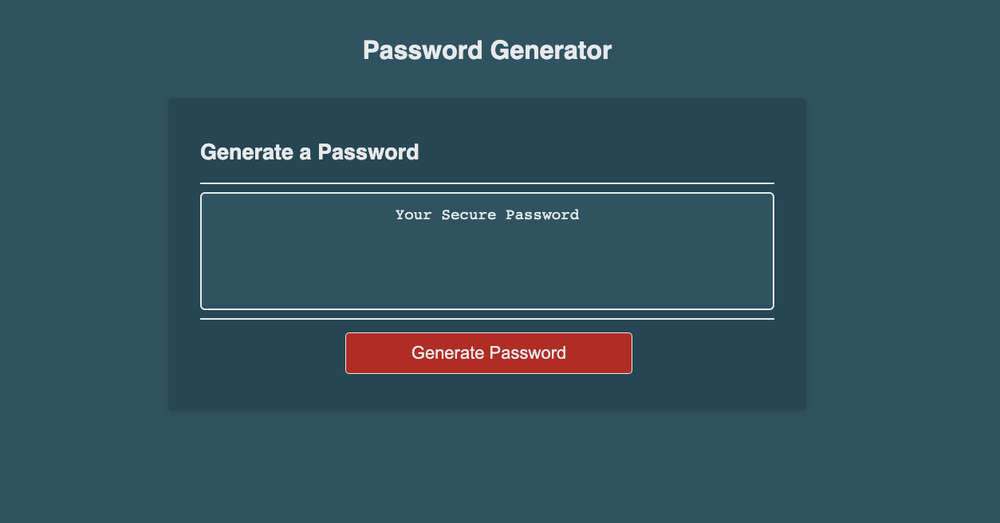

# Random Password Generator App

## Description

This application creates a randomly generated password based on the criteria a user selects. Powered by JavaScript, this responsive app runs in the browser and features dynamically updated HTML and CSS.

Summary:

- Generation of a password when the 'Generate Password' button is clicked
- Presents a series of prompts for password criteria
- Minimum password length is 10 characters; maximum password length is 64 characters
- Passwords can be created with a variety of character types
- For example: lower case, upper case, numeric or special characters can be used
- Each input is validated by the app, and at least one character type must be selected
- A generated password is written to the page once all prompts have been answered

Click to view the [Live Application](https://mdyeates.github.io/random-password-generator/)

## Installation

N/A

## Screenshot

## Credits

- [MDN Web Docs JS](https://developer.mozilla.org/en-US/docs/Web/JavaScript)
- [Net Ninja](https://www.youtube.com/playlist?list=PL4cUxeGkcC9i9Ae2D9Ee1RvylH38dKuET)
- [freeCodeCamp](https://www.freecodecamp.org/)
- [The Odin Project](https://www.theodinproject.com/)

## Contact

## License

Please refer to the LICENSE in the repo for more information.
